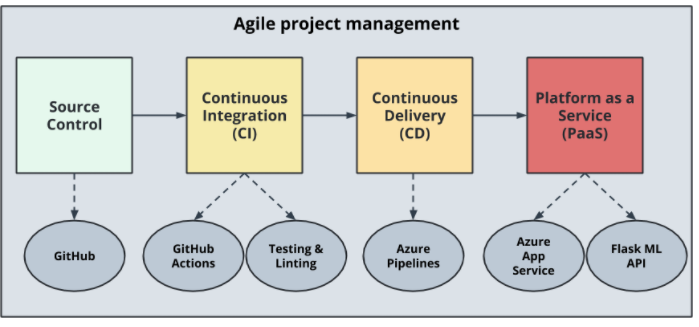
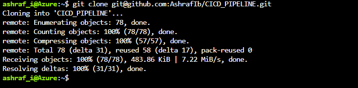
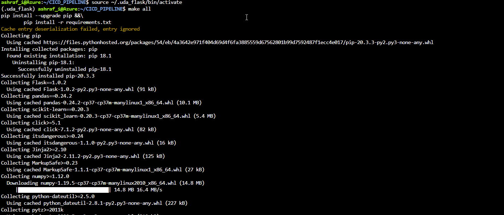
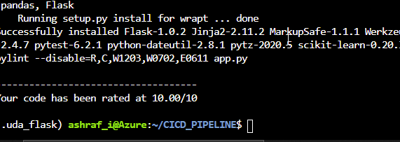
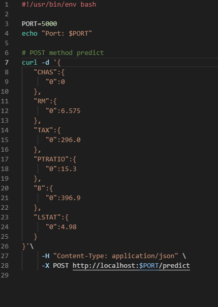
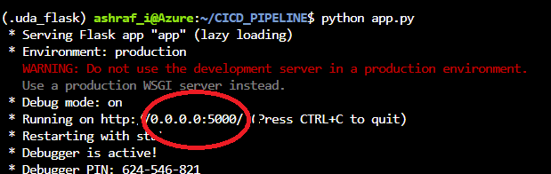
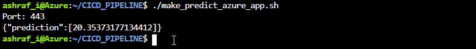

# Introduction


Author: Ashraf Ibrahim <br>

Date: 05.01.2021 <br>

This repo is for my Udacity Project "CICD Pipeline" in the DevOps Engineer for Azure course. This project includes a Flask app for estimating home prices in Boston, but the focus is on the CI-CD pipeline behind it. 

Any change in code automatically triggers Github actions so that the code is tested and linted (CI), then deployed via Azure Pipeline (CD), and finally deployed as a webapp from Azure. 


# Project Plan


The elaboration of the course content and the ToDo's of the project were tracked by me via Trello. The exact work packages can be seen in my [Trello Board](https://trello.com/b/R4aXBL3X/cicd). I took care to create work packages that were as precise as possible so that they could be processed accurately. <br>


I have recorded the sequence of processing I considered earlier in a [sheet](https://github.com/AshrafIb/CICD_PIPELINE/blob/master/PLAN.xlsx). 

# Instructions


## Architectural Structure 



The sequence in the picture corresponds to the steps mentioned above, the sequentiality clarifies the structural design as well as the interdependencies of individual steps.

## Deployment of  Webapp in Azure 

In order to start the project in your own Azure account, the following steps have to be performed: 

First clone this Repository via https or ssh, then move to folder, create an environment via make setup, activate this environment and install all dependencies via makefile. 

```
# Cloning via ssh 
git clone git@github.com:AshrafIb/CICD_PIPELINE.git

# move to cloned directory 
cd CICD_PIPELINE

# create Environment
make setup 

# activate Environment 
source ~/.uda_flask/bin/activate

# install dependencies and run tests 
make all 

```


The Git-Cloning Process should look like:



The *make all* Process should install all dependencies and do the linting job:

 

 The linting Job is the last step of the makefile and should give you a score: 

 

Then you can start the App in your local Environment and do a prediction (Open a new CLI for that and go to repo-folder)

```
# Start App 
python app.py 

# Make Prediction 
./make_prediction.sh
```

If an error occurs:

​	make the bash file executable with: 

```
chmod u+x ./make_prediction.sh
```

​	and change the Port in make_prediction.sh: 

 

​	to match the port of the flask app



this will give you a result: 




