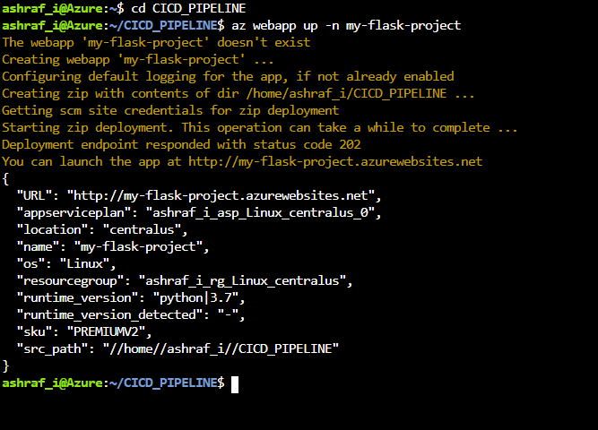
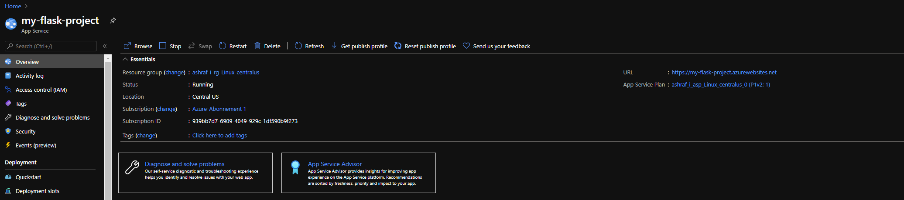
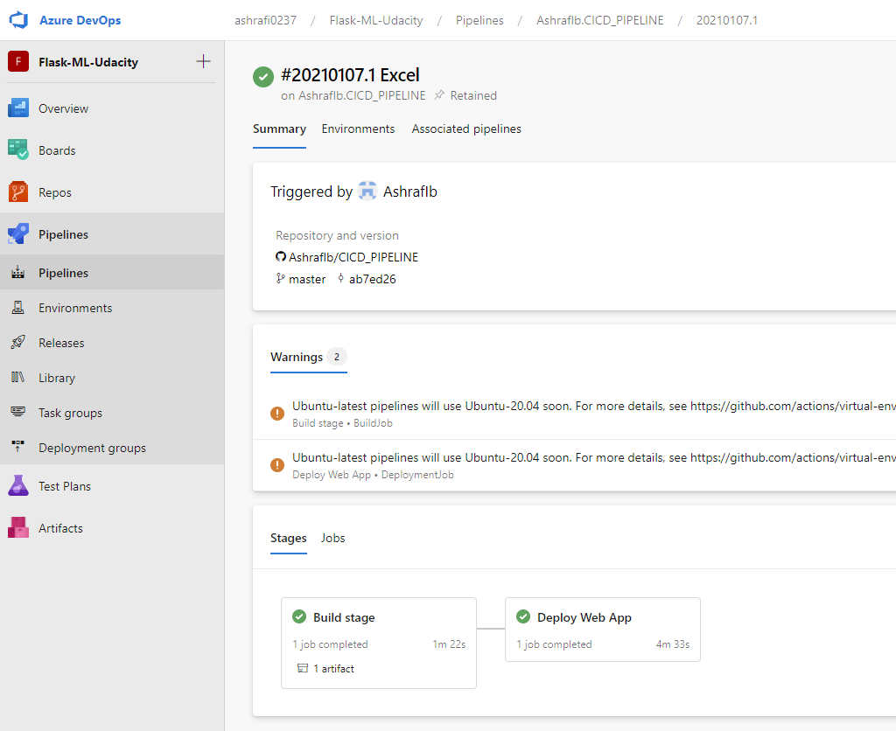
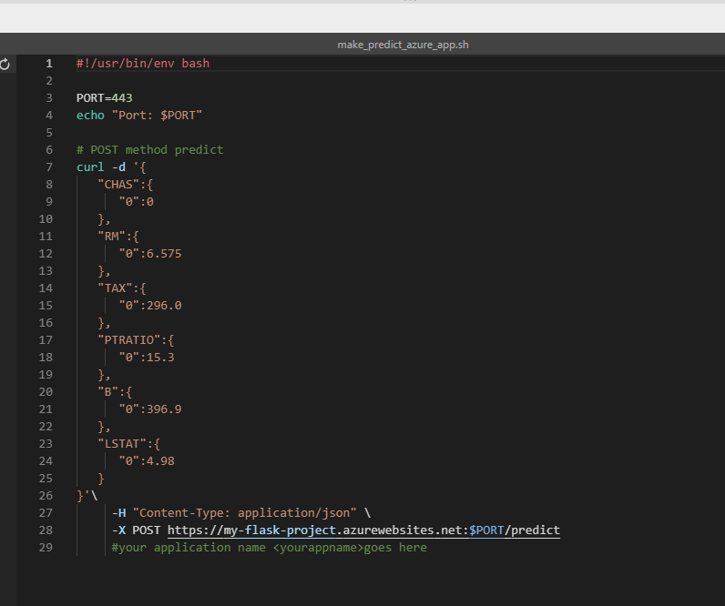
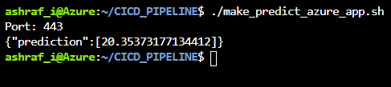
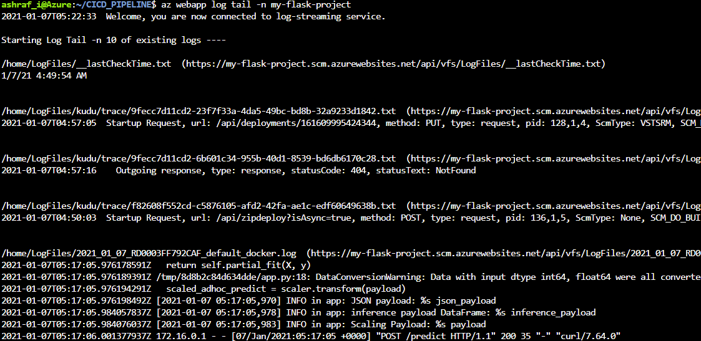
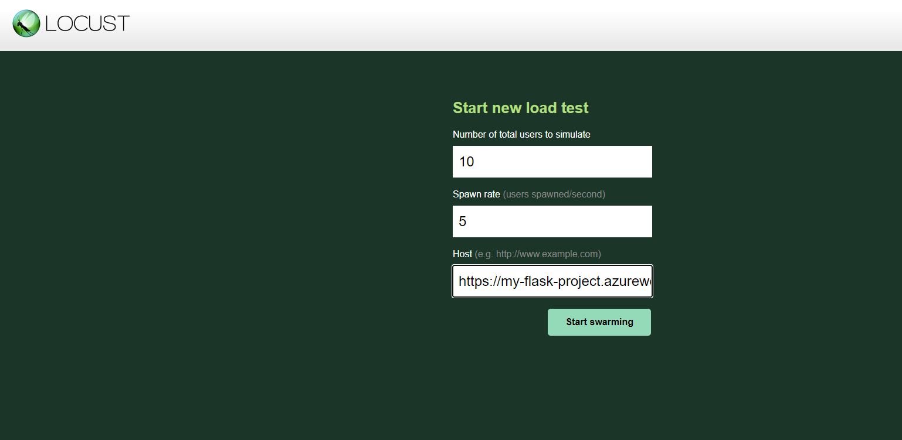
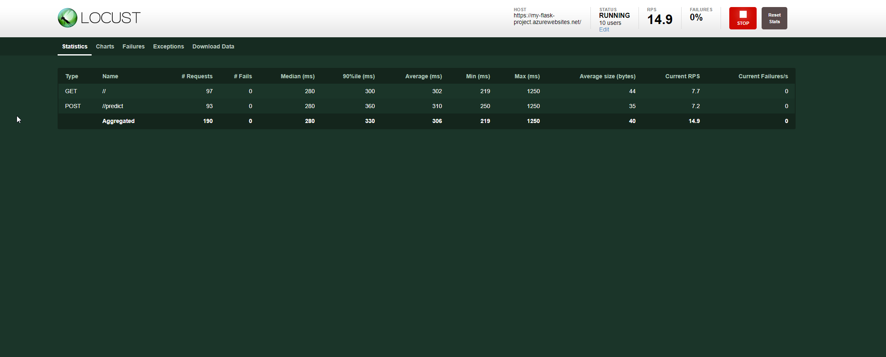

# Introduction

Author: Ashraf Ibrahim <br>

Date: 05.01.2021 <br>

This repo is for my Udacity Project "CICD Pipeline" in the DevOps Engineer for Azure course.  This project includes a Flask app for estimating home prices in Boston, but the focus is on the CI-CD pipeline behind it. 
Any change in code automatically triggers Github actions so that the code is tested and linted (CI), then deployed via Azure Pipeline (CD), and finally deployed as a webapp from Azure. 

You can watch my live-demo on [Youtube](https://youtu.be/rYgqRtU0mLA).  

# Project Plan

The elaboration of the course content and the ToDo's of the project were tracked by me via Trello. The exact work packages can be seen in my [Trello Board](https://trello.com/b/R4aXBL3X/cicd). I took care to create work packages that were as precise as possible so that they could be processed accurately. <br>

I have recorded the sequence of processing I considered earlier in a [sheet](https://github.com/AshrafIb/CICD_PIPELINE/blob/master/PLAN.xlsx). 

# Instructions

## Architectural Structure 


The sequence in the picture corresponds to the steps mentioned above, the sequentiality clarifies the structural design as well as the interdependencies of individual steps.

## Running Webapp in Azure Cloud Shell

In order to start the project in your own Azure account, the following steps have to be performed: 

First clone this Repository via https or ssh, then move to folder, create an environment via make setup, activate this environment and install all dependencies via makefile. 

```
# Cloning via ssh 
git clone git@github.com:AshrafIb/CICD_PIPELINE.git

# move to cloned directory 
cd CICD_PIPELINE

# create Environment
make setup 

# activate Environment 
source ~/.uda_flask/bin/activate

# install dependencies and run tests 
make all 

```

The Git-Cloning Process should look like:


The *make all* Process should install all dependencies and do the linting job:

 

 The linting Job is the last step of the makefile and should give you a score: 

 

Then you can start the App in your local Environment and do a prediction (Open a new CLI for that and go to repo-folder)

```
# Start App 
python app.py 

# Make Prediction 
./make_prediction.sh
```

If an error occurs:

​	make the bash file executable with: 

```
chmod u+x ./make_prediction.sh
```

​	and change the Port in make_prediction.sh: 

 

​	to match the port of the flask app


this will give you a result: 


# Deployment of Webapp in Azure App Service

To publish the webapp in Azure without pipeline, the following command must be entered into Azure Cloud Shell, but first maneuver to the repo's folder in Azure.: 

```
# Go to Folder
cd NameOfRepo

# Start Webapp   
az webapp up -n NameOFWebapp
```

This should initiate the webapp with your selected name (e.g *my-flask-project.azurewebsites.net*) - of course you can visit this url.  




Your Flask Project should be up and running and viewable in your Azure-Account:



Create an [Azure Pipeline](https://docs.microsoft.com/en-us/azure/devops/pipelines/ecosystems/python-webapp?view=azure-devops) and then you can take a look into your Pipeline on Azure DevOps:

 

If you've built the pipeline and connected it to your Github repo, you can now watch how changing the scripts in the repo initiates a new deployment! 

And finally, now you can make an estimate. To do this, go back to the repo's folder in Azure Cloud Shell and do the following steps: 

+ Edit the url in make_predict_azure_app.sh to match your website 

  

+ make the make_predict_azure_app.sh executable with

  ```
  chmod u+x ./make_predict_azure_app.sh
  ```

+ and then type 

  ```
  ./make_predict_azure_app.sh
  ```

+ now you should recieve some results 

  

+ and you can inspect the logs of your webapp by typing

  ```
  az webapp log tail -n WebAppName
  ```
+ which will give you the logs 
  



# Locus-Test

 To create a stress test the Locus module can be used. In order for a test to be performed, the following steps must be carried out:

+ Install Locus 

  ```
  pip install locust
  ```

+ Go to your repo via cli and run the app.py 

  ```
  python app.py
  ```

+ Check if the locusfile.py is in your folder and run it 

  ```
  locust
  ```

+ Now you can open a browser and go to the [http://localhost:8089](http://localhost:8089/)

+ Now you should see an input mask where you can enter the webpage as well as configurations for the stress test - I am going to check on Azure-Webapp:

  

+ Finally, you can see the stress test running 

  

+ Everything is up and running! Get the website as well as do a prediction ist working fine! 

# Improvement Ideas 

To make my pipeline a bit more efficient and robust, I would like to divide my repo into branches. So there would be one branch for development and one for deployment. The development branch should be excluded from the Azure pipeline. 

Other than that, i want to modify Github Actions to ignore changes to certain files. Not every file has an impact on the code. Changes to the Excel file are more important for me and visitors of my Repo to be informed of my future steps and do not effect the code or the Webapp. 

